# WaterTable

### What is WaterTable?

WaterTable is a physical modeling system that simulates several different physical systems in a circular channel. These systems are:

* The Wave Equation

  which is a model of waves in water, air, and strings

* The Squid Giant Axon

  which is a model of the axon in a squid's nervous system that controls its water jet propulsion, and is more generally a model of excitable media

* The Schrödinger Equation

  which is the governing equation for quantum-mechanical waves

* Runge-Kutta Advection

  which is a model of the motion of substances carried by a fluid

...and possibly more to be added in the future.

WaterTable enables you to interact with these systems in real time with a variety of controls. WaterTable can act as a resonator, stereo mixer/expander, filter, or distortion, and is designed to be both versatile and a little bit crazy.

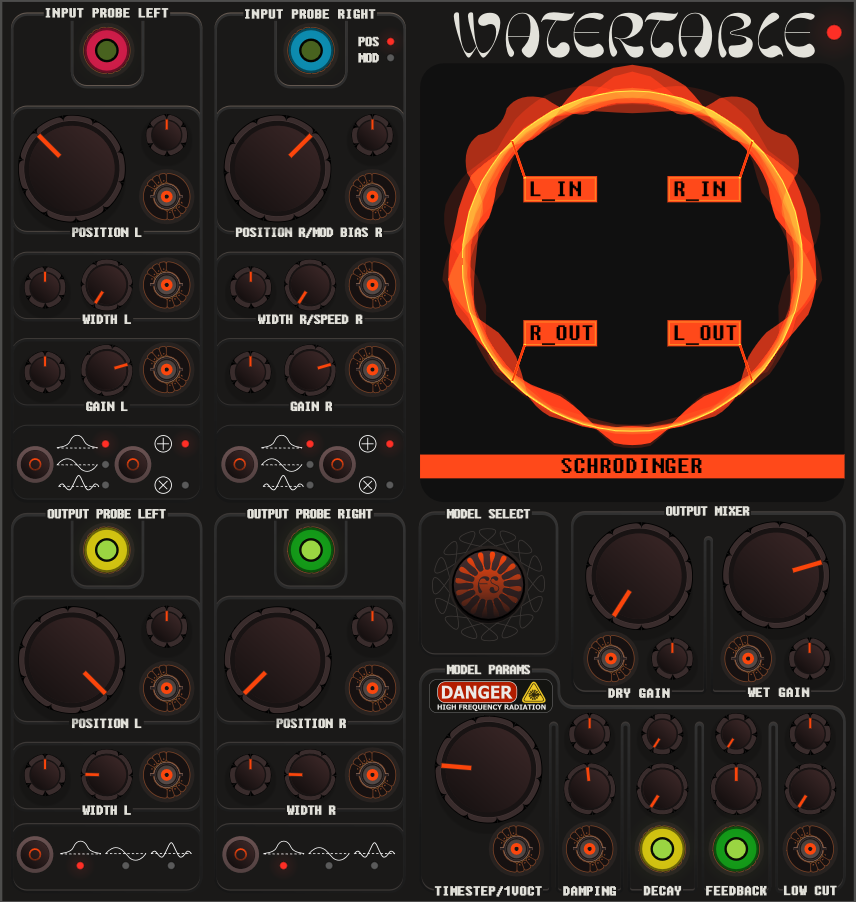

### Using WaterTable

#### Inputs and Outputs

​		WaterTable takes two mono inputs and two mono outputs. Using both inputs or outputs is not required. WaterTable is primarily meant to accept audio inputs, but will also happily accept triggers in the inputs as an impulse, which can be used to get plucked string or drum sounds.

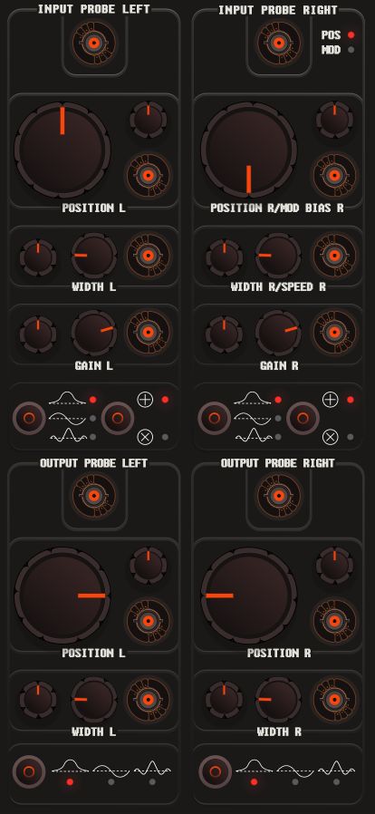

#### Probe Controls

##### Position

​		Each input and output has a set of associated controls. You can think of each input and output as being physically placed at a particular location in the WaterTable channel, as if you were plucking it or placing a pickup in different locations. The inputs and outputs to WaterTable are called PROBES. The position of the probes in the channel is controlled with the associated POSITION knob.

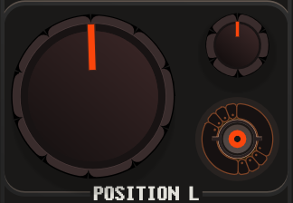

##### Gain

​		The inputs have a GAIN control, which basically works as you'd expect, and increases or decreases the volume of the input before it's sent into WaterTable.

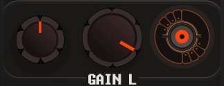

##### Width

​		Each probe also has a width, and a pattern. The width controls how large of an area the probe will affect. When the input probe width is small, you can think of WaterTable as plucking the channel with a pin. When the width is large, it's like slapping the channel with a paddle. For the outputs, the same sort of logic applies. When the width is small, the probe listens for vibrations over a tiny area. When the width is large, it's averaging out the vibrations over a large portion of the channel.

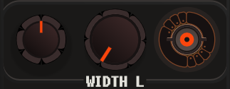

​		

##### Pattern

​		Where width controls the size of the probe, the pattern buttons control the *shape* of the probe, and *how* the probe will be applied to the channel. The left button pictured below switches between three modes, from top to bottom: INTEGRAL, DIFFERENTIAL, and SINC. These modes change the shape of the probe pattern, which is analogous to plucking a string by either pulling it with one finger, or taking it between two or more fingers and twisting it to put tension on the string.

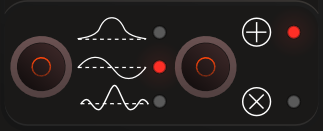

​		The right button pictured above controls whether the input probe is added or multiplied to the channel. When the mode is set to ADDITION, the input probe value is added to the channel at its current position. When the mode is set to MULTIPLICATION, the input probe value is first multiplied by the current channel value before being added to the channel. The multiplication mode results in a ring modulation type effect.

​		**NOTE**: When both inputs are set to MULTIPLICATION mode, it's possible that the entire channel will become inactive (all values will become zero). Since anything times zero is zero, this means the inputs will no longer have an effect. You can fix this by temporarily switching one input to ADDITION mode. This issue may be fixed in the future by adding a small amount of noise to the channel.

### Model Parameters

#### Important Usage Notes

​		WaterTable simulates systems that are inherently unstable and unpredictable. In certain configurations, WaterTable may squeal, ring, or spontaneously get very loud. With that said, a variety of precautions have been taken to make it so that WaterTable can't get into such a state *unrecoverably*, and also gives you the tools to tame it.

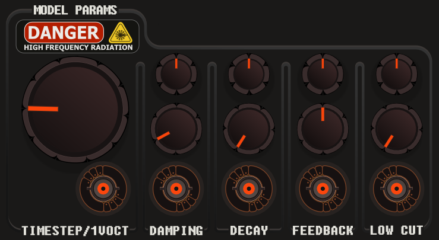

#### Parameters

##### Timestep

​		The TIMESTEP parameter controls the internal timestep of the system, or, how much it changes every time it updates. This corresponds directly with pitch and resonant frequency, and so for your convenience, the timestep knob has been tuned to the 1V/Oct system, with 0 volts corresponding (roughly) to C4. WaterTable can't be tuned to C4 for all possible combinations of inputs, so instead we've settled for being close under default settings.

​		**NOTE**: The maximum possible timestep value corresponds to VCV's sample rate, so if your sample rate is set to 44.1kHz for example, the timestep knob will stop increasing past a certain point. This is necessary because WaterTable becomes extremely unstable above certain timestep values. See more about this in the **Technical Details** section below. WaterTable will also retune itself according to the current sample rate.

##### Damping

​		The DAMPING parameter controls how much oscillations *diffuse* over time. This is a somewhat different meaning of *damping* than you may see in other audio software, but it has a similar effect on the overall behavior. When a stable oscillation sets up in the WaterTable channel, the damping parameter can be used to calm it down. The damping parameter will also tend to "smooth out" high frequency content in the output.

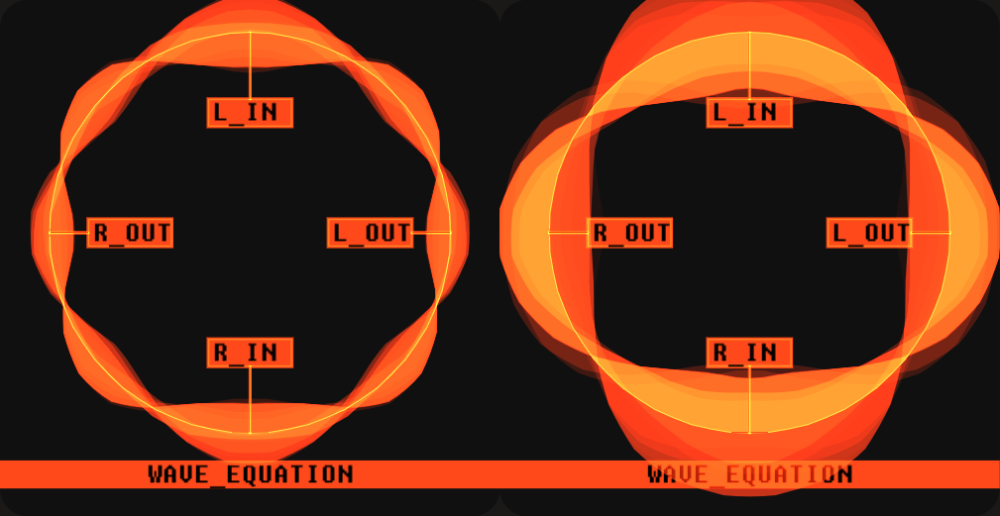

*Stable oscillations in the WaterTable display*.

##### Decay

​		The DECAY parameter controls how quickly oscillations in the WaterTable channel die out. This can be used to create short, plucky sounds, and can also be used to keep WaterTable under control when it's oscillating wildly. When the decay is turned to zero, oscillations can continue for a long time, which can be useful for creating resonant, gong-like sounds.

##### Feedback

​		WaterTable feeds back into itself in both space and time. Oscillations feed back on themselves by reverberating around in the WaterTable channel, and also by being fed from the left and right output probes back into the corresponding input probes. The FEEDBACK parameter controls the latter. Both positive and negative feedback is allowed, so the 0.0 position corresponds to no feedback. When feedback is turned up, every other parameter in WaterTable (aside from the Output Mixer parameters) will affect whether it starts going out of control, so be careful with this one. But have some fun with it too.

##### Low Cut

​		The LOW CUT parameter controls a simple high pass filter on the input. This is a quick way to create sounds that are more "plucky" or "ringy," or sound more like brushes on drums.

### Output Mixer

​		WaterTable has independent controls for the dry and wet output gain. Mix these to your liking and check the output in a scope in X-Y mode (I recommend NYSTHI Etchasketchascope) to see the crazy things WaterTable can do to the stereo field, among other things.

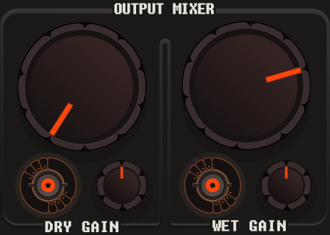

### Model Select

​		The big inviting button where the fun happens. Press this to switch between the four models listed above.

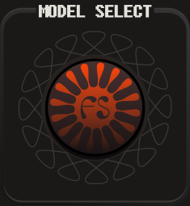

### The WaterTable Display

​		The WaterTable display is designed to give you a reasonably complete view of the internal state of the WaterTable channel, the four probes, and the currently selected model at a glance. The probe positions are indicated by the corresponding label, and their positions on-screen correspond directly to their positions in relation to one another internally. Note that before audio is output by WaterTable, a few steps are taken to make the output more user-friendly (DC bias removal and scaling), but the display reflects the true internal state of the WaterTable channel.

### Alternative Mode

#### Special Controls for Runge-Kutta Advection

​		When WaterTable's current model is set to RUNGE KUTTA RK4, the controls for the right input probe change. The current control mode of the right input probe is indicated by an LED, which changes from POS*ition* to MOD*ulation* when the RUNGE KUTTA RK4 model is selected. This control mode is not directly toggleable, and only applies to this model.

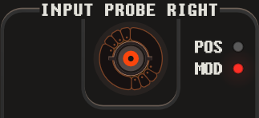

​		When using this model, the right input probe becomes a modulation input, and the probe pattern controls are disabled.

#### What Does This Mode Do?

​		From a practical perspective, this mode can be used to create surprisingly realistic recreations of plucked string instruments, as well as weird, unconventional modulation effects.

​		From a theoretical perspective, the advection equation describes how substances are transported around by a moving fluid. The fluid is moving at a particular speed, and whatever substance is being pushed around moves with it. In this mode, the right input probe controls the fluid speed, and the left input probe is injecting the "substance" that gets pushed around. For example, this means that a pulse that enters the left input probe gets added into the channel, and then it rotates around the channel, either clockwise or counterclockwise, according to the settings of the right input probe.

**NOTE**: No input needs to be connected to the right input probe for this mode to work.

#### Right Probe Controls in Modulation Mode

​		When in modulation mode, the POSITION knob becomes a MOD BIAS knob, and the WIDTH knob becomes a SPEED knob. GAIN has the same function, but is routed differently internally.

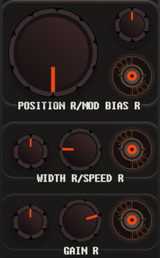

##### Mod Bias

​		The MOD BIAS parameter is the *base* rotation speed. This is a constant value that controls how fast and in which direction a pulse (or any other input) that enters the left input probe rotates around the WaterTable channel. The MOD BIAS parameter *biases* the speed and in one direction or another regardless of whether there is an input connected to the right input probe. When an input is connected to the right input probe, the MOD BIAS is added to the value coming from the connected input.

##### Speed

​		The SPEED parameter is a multiplier on both the MOD BIAS and the GAIN. After the MOD BIAS is added to the value from an input connected to the right input probe, the sum is multiplied by the SPEED parameter to get the final fluid speed.

##### Gain

​		As in POSITION mode, this is a multiplier applied to the right input. In this mode however, the right input is used to control how fast waves rotate around the WaterTable channel. This makes it possible to rotate the contents of the channel back and forth at audio rate, creating interesting modulation possibilities.

#### The Display in Modulation Mode

​		When in modulation mode, the WaterTable display changes. The right input is removed, and is replace by an animated dial inside of the WaterTable channel visualizer. The dial indicates the current speed and direction of rotation, and will move in response to input connected to the right input probe.

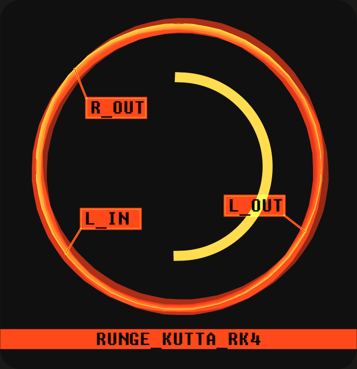

### Technical Details

#### Integration and Stability

​		Each of the systems listed above is implemented using a differential equation solver, i.e. they are integrated over time. Each of these systems also has an associated *timestep size* which controls how large of a step in time we take each integration step. We want to use these systems to generate audio, and so the timestep size can be controlled to change the rate that the system oscillates (i.e. the pitch). However, these systems become very unstable at timestep sizes that we would realistically like to use to generate audio in real time. So, a few measures have been taken to make that possible. Soft clipping is used on the internal buffers, feedback paths, and outputs; this may be noticeable when using high input gain or feedback. The Runge-Kutta 3/8's method is used for the integration scheme, which is conceptually similar to 4-fold oversampling, and among other things, is used in some analog circuit modeling applications. Feedback paths, inputs, and outputs are also lowpass filtered (biquad) to 1/2 VCV's current sample rate. Nonetheless, WaterTable is designed to let you take it as close to the limits of stability as possible, and *will* be unstable with some parameter settings.

#### Spatial Layout

​		Unlike most analog circuit modeling applications, we are not working with a pure dynamical system, i.e. one that evolves only according to its current state and derivatives in time. We also need derivatives in space to compute diffusion and advection, i.e. how the simulated waves propagate in space. WaterTable runs each simulation on a collection of buffers which each store 64 floating point values. The buffers are "connected" at each end to form a ring. Spatial derivatives are computed on these buffers (using hardware vectorization intrinsics). In DSP terms, you might think of WaterTable as a bank of 64 analog filters in a row that all "talk to" their neighbors.

#### Aliasing and Probes

​		The input and output probe shapes have been designed to minimize aliasing where possible. To this end, the INTEGRAL and DIFFERENTIAL probe modes are computed as the (approximate) derivatives of the error function and gaussian respectively. This helps reduce noise from moving the probe position, especially when the probe width is small. Probe weights are also normalized. Computing probe weights is somewhat expensive, so they will only be recomputed when necessary, i.e. when the position or width knobs are turned or CV is connected to the position or width inputs.

#### Performance

​		WaterTable uses an inherently computationally expensive algorithm. Many implementations compute simulations like these on the GPU to get acceptable performance, but this isn't feasible for real time audio use (because latency is too high). Where ever possible, WaterTable uses Rack's SIMD vectorization intrinsics, and certain values (probe weights, knob controls) are only computed when values change. WaterTable is not currently multithreaded; this option may be explored in the future.

### Acknowledgements and License

WaterTable is licensed under the GPLv3 License.

WaterTable uses the Fixedsys Excelsior font, which is licensed under the public domain.

https://github.com/kika/fixedsys

For pre-release profiling, WaterTable uses Nanotime, which is licensed under the MIT license.

https://github.com/jbenet/nanotime

Other projects in this repository use libsamplerate, which is licensed under the BSD license.

https://github.com/libsndfile/libsamplerate

The VCV logo and icon are copyright © 2017 VCV.

The VCV name is a trademark of Andrew Belt.